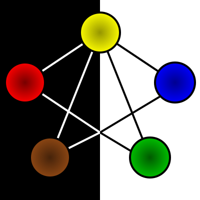

# Goals
## Pillars
1. Player character narative first
2. Gameplay should be a fun, thought provoking optimisation problem with many facets
3. All players should be able to be engaged as much as possible
4. A session should be 2-3 hours

## Primary Goals
 - Simple in game mechanics (1,4)
 - Complex mechianics away from the table are acceptable, provided they add to the experience in a significant way, and the reason for the complexity should be overt to the player (2)
 - Rules should be on cards; rule books should not be required to play, when familiar (1,3)
 - GM screen, or other short notes is acceptable, though should be avoided where possible
 - 'Leveling up' should be exciting (2)
 - New abilities should have a noticable, and fun, impact on gameplay (2)
 - Combat stragety, skill challenges, character and party design (2)
 - Multiple characters should work together (2,3)
 - Characters should be good at what they are good at, and bad at bad; random spikes should be rare and dramatic (1,2,3)
 - Only roll for things that impact the narrative (1,2)
 - Remove the 'busy work', and focus on the narrative, without removing tactical depth (1,3,4)
 - Create a strong roleplaying experience (1)
 - Mechanics should be tied to the narrative (1,2)
 - Good roleplaying and decicion making should be rewarded (1,2)
 - Combat should be around 30-60 mins of this time, in general (1,3,4)
 
## Secondary Goals
### Combat
 - Turns should be short
 - Turns should be impactful and dramatic
 - Turns should be able to be planned for ahead of time as much as possible; minimal changing numbers inside a turn.
 - Player characters should be able to work together for tactical advantage
 - Random encounters should be simple to generate
 - Planned encounters should be able to be crafted by the GM
 - Card affects should be able to be understood in world
 - Combat should be a collective excersise for players and characters
 - Combat should be as simple as possible for the GM
    - Minimise tracking different effects
    - When tracking is required, tie it to something physical, and obvious

### Social
 - Players should always be able to be engaged
 - Players should not be required to always engage
 - Good roleplaying should create more interesting and enjoyable interactions
 - Players who cannot roleplay a section should still be able to engage

### Skill challenges
 - No trivial tests; trivial actions should not require a roll
 - Players and player characters should be able to help each other, where it makes sense
 - Group tests should exist
    - Group tests should not pass or fail based on a single players' roll

### Cards
 - Methodology for creating cards should be open
 - Tables should be able to create their own cards
 - 'Classless' system in conventional way, but cards should follow a theme, like a social 'class'
 - Characters should not be locked out of a particular path of progression, but unlocakables are allowed
 - GM always has the last call if a character may get a card

# Forces
2 Sides:
 - Black: external forces
 - White: internal forces

# Spheres
5 Spheres:
 - Lightning (yellow): dexterity, quick thought, change
 - Fire (red): strength, aggression, force of will on others
 - Water (blue): intelligence, outlandish thinking, innovation
 - Earth (brown): constitution, health, balance, intimidation
 - Spirit (green): mental strength, memory, will power

All forces are connected to lighting (change). Lightning is both internal and external.

# The Flow
The movement of elements between each other; moving of counters between the spheres.

The Major Flows are the connections between Lightning and the other elements. These represent the links of different
elements to change.

The Minor Flows are the connections between Earth and Water, and Spirit and Fire.

Characters start with 1 gem of each color.
Characters can move gems along flows as an action.

# Mechanics
- Number of gems in a sphere (possibly of a particular colour)
- Number of gems moved in/out of a sphere, or along a particular flow or type (Major/Minor) flows.
- Number of gems in either Inner or Outer Forces. 
- Balance of gems in Inner and Outer Forces. 
- Balance of gems in opposing elements (non-connected Spheres)
- Balance of gems moved between Spheres or Forces.

# Magic/Abilities
Cards can be used for magic and abilities. Possible status of cards:
- Static
    - Tapped
    - Untapped
- Played
    - Tapped
    - Untapped
- In hand
- In deck
- Discarded
- Available (think face up but not in deck, like a deck builder)

Doing actions with cards should require some interaction with the board.
