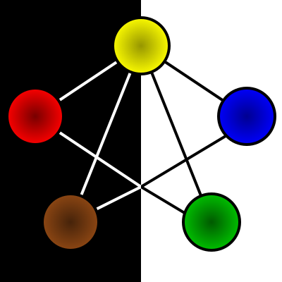

# Forces
2 Sides:
 - Black: external forces
 - White: internal forces

# Spheres
5 Spheres:
 - Lightning (yellow): dexterity, quick thought, change
 - Fire (red): strength, aggression, force of will on others
 - Water (blue): intelligence, outlandish thinking, innovation
 - Earth (brown): constitution, health, balance, intimidation
 - Spirit (green): mental strength, memory, will power

All forces are connected to lighting (change). Lightning is both internal and external.

# The Flow
The movement of elements between each other; moving of counters between the spheres.

The Major Flows are the connections between Lightning and the other elements. These represent the links of different
elements to change.

The Minor Flows are the connections between Earth and Water, and Spirit and Fire.

Characters start with 1 gem of each color.
Characters can move gems along flows as an action.

# Mechanics
- Number of gems in a sphere (possibly of a particular colour)
- Number of gems moved in/out of a sphere, or along a particular flow or type (Major/Minor) flows.
- Number of gems in either Inner or Outer Forces. 
- Balance of gems in Inner and Outer Forces. 
- Balance of gems in opposing elements (non-connected Spheres)
- Balance of gems moved between Spheres or Forces.